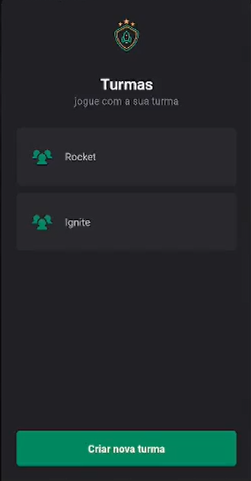
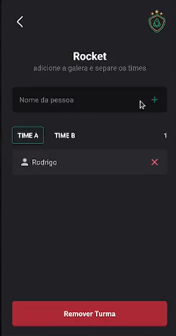

  <a href="#tecnologias">Tecnologias</a>&nbsp;&nbsp;&nbsp;|&nbsp;&nbsp;&nbsp;
  <a href="#projeto">Projeto</a>&nbsp;&nbsp;&nbsp;|&nbsp;&nbsp;&nbsp;
  <a href="#layout">Layout</a>

## Layout

    
    
    
    

## 🚀 Tecnologias

Esse projeto foi desenvolvido com as seguintes tecnologias:
- [React-Native](https://reactnative.dev/)
- [Styled-components](https://styled-components.com/)

## 💻 Projeto
